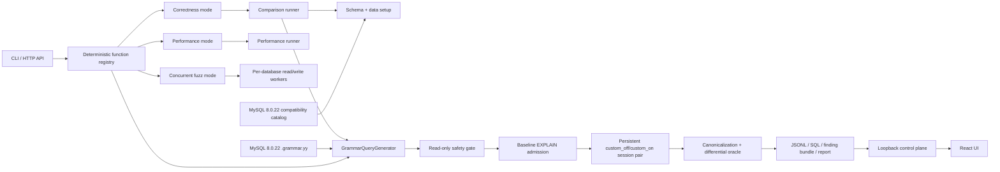

# select-fuzz 项目结构

> 更新日期：2026-08-22。项目以 MySQL 8.0.22 为兼容基线，包括 SELECT correctness 差分测试、性能测试、并发读写 fuzz、覆盖验证、回放和可视化控制台。

## 总体架构

项目由 Python 后端、版本化查询 catalog/grammar、React 前端和自动化测试组成。correctness 模式只有一条查询生成路径：`GrammarQueryGenerator`。旧 typed-AST 查询生成器、renderer 和 batch planner 已删除。



模式的稳定入口统一放在 [`src/select_fuzz/modes/`](../src/select_fuzz/modes)：

```text
modes/
├── contracts.py       # ModeDefinition/ModeRunner/ModeFactory
├── registry.py        # correctness/performance/fuzz 唯一注册表
├── correctness/       # 两实例结果对比入口；兼容旧实现
├── performance/       # 两实例性能对比入口；兼容旧实现
└── fuzz/              # 单集群、多库、多读写线程 fuzz 实现
```

`correctness` 和 `performance` 的旧模块暂时保留为兼容层，新的调用路径只依赖
各自 `modes/<mode>/entrypoint.py`。新增模式时只需实现同一个 `ModeRunner` 契约、
在注册表加入一项，并补充对应配置/CLI/API 字段；共享的连接、执行、查询生成和
artifact 代码继续放在各自的公共包中。

## 根目录

```text
select_fuzz 2/
├── catalog/                 # MySQL 8.0.41 历史能力目录与 MySQL 8.0.22 SELECT 文法
├── config/                  # correctness/performance 示例配置
├── docs/                    # 研究报告、测试计划、项目结构
├── frontend/                # React + TypeScript 控制台
├── packaging/centos7/       # CentOS 7 / glibc 2.17 bundle 构建定义
├── python/                  # 无系统 Python 时的可移植运行时构建入口
├── scripts/                 # soak、grammar 优化、来源锁、长时验证脚本
├── src/select_fuzz/         # Python 主程序
├── tests/                   # 单元、集成、性质、API、前端外的后端测试
├── pyproject.toml           # Python 包、命令入口和工具配置
└── uv.lock                  # Python 依赖锁
```

`python/build-centos7-bundle.sh` 使用 manylinux2014 x86_64 构建镜像，把
CPython 3.11、运行时依赖、源码和 SQL catalog 收集到一个可复制的目录中；
CentOS 7 目标机只需运行 bundle 内的 `select-fuzz`，不需要预装 Python、pip
或 uv。

## 查询生成核心

| 文件 | 职责 |
| --- | --- |
| [`catalog/mysql-8.0.22-select.grammar.yy`](../catalog/mysql-8.0.22-select.grammar.yy) | 版本化 SELECT 文法 |
| [`catalog/mysql-8.0.41-query-shapes.yaml`](../catalog/mysql-8.0.41-query-shapes.yaml) | 官方来源锁、feature、variant、版本和 schema profile |
| [`generation/query_grammar.py`](../src/select_fuzz/generation/query_grammar.py) | 文法解析、随机展开、作用域/类型/表列绑定、稳定 alternative ID |
| [`generation/function_registry.py`](../src/select_fuzz/generation/function_registry.py) | 确定性函数安全签名、参数类型、NULL witness 和 warning 契约 |
| [`generation/query_scope.py`](../src/select_fuzz/generation/query_scope.py) | 默认排除 JSON、FULLTEXT、SPATIAL family/profile |
| [`generation/query_safety.py`](../src/select_fuzz/generation/query_safety.py) | 单语句、只读、无会话变量和副作用语法校验 |
| [`generation/query_determinism.py`](../src/select_fuzz/generation/query_determinism.py) | 非零 LIMIT 的保守确定性准入，阻止不稳定 Top-N 进入差分 Oracle |
| [`generation/query_contract.py`](../src/select_fuzz/generation/query_contract.py) | artifact/replay 共用的 lane 与 expected-error 数据契约，不生成 SQL |

correctness 的实际调用链：

```text
select-fuzz run --mode correctness
  -> cli.run_command
  -> correctness.build_correctness_runner
  -> GeneratedRoundSource.materialize
  -> GeneratedRoundSource.generate_query
  -> GrammarQueryGenerator.generate
  -> EXPLAIN admission
  -> triad execute and compare
```

## Python 后端模块

| 目录或文件 | 职责 |
| --- | --- |
| [`cli.py`](../src/select_fuzz/cli.py) | `run`、`doctor`、`report`、`replay`、`regression-seeds`、`serve` 命令 |
| [`modes/correctness/`](../src/select_fuzz/modes/correctness) | 两实例结果对比模式的稳定入口与兼容层 |
| [`modes/performance/`](../src/select_fuzz/modes/performance) | 两实例性能对比模式的稳定入口与兼容层 |
| [`modes/fuzz/`](../src/select_fuzz/modes/fuzz) | 多数据库并发 writer/reader、随机 50+ 列 schema、DML/SELECT 生成、流式执行、重连和独立初始化 |
| [`correctness.py`](../src/select_fuzz/correctness.py) | correctness round、grammar 动态查询、EXPLAIN 准入、两实例执行和结果持久化（兼容实现） |
| [`service.py`](../src/select_fuzz/service.py) | worker/round 生命周期和运行汇总 |
| [`config/`](../src/select_fuzz/config) | 严格 Pydantic 配置、YAML/CLI 覆盖和凭据环境变量解析 |
| [`domain/`](../src/select_fuzz/domain) | 节点结果、运行请求、种子树、稳定指纹等领域模型 |
| [`generation/`](../src/select_fuzz/generation) | schema、data、setup、mutation、grammar、coverage 和安全策略 |
| [`execution/`](../src/select_fuzz/execution) | MySQL 连接租约、活动连接注册表、成对建连、超时、setup、pair 与 mutation 执行 |
| [`oracle/`](../src/select_fuzz/oracle) | 结果规范化、两实例差分、错误分类和连接器元数据 advisory |
| [`artifacts/`](../src/select_fuzz/artifacts) | finding v2（外置 gzip SQL）、查询尝试 JSONL、线程 SQL、HTML 报告和读取索引；reader 兼容 v1 |
| [`api/`](../src/select_fuzz/api) | loopback FastAPI 控制面、事件流、运行监督和 replay API |
| [`performance/`](../src/select_fuzz/performance) | 独立性能 fuzz template、校准、物化、执行和性能 oracle |
| [`validation/`](../src/select_fuzz/validation) | 官方候选发现、shape signature、grammar 见证、reachability、ledger 和报告 |
| [`replay.py`](../src/select_fuzz/replay.py) | 在新数据库上重放已保存 finding，不重新生成查询 |
| [`grammar_optimization.py`](../src/select_fuzz/grammar_optimization.py) | 基于覆盖反馈调整 grammar 权重并执行验收 |
| [`regression.py`](../src/select_fuzz/regression.py) | 固化 grammar production/alternative 与 schema profile 的稳定种子 |
| [`doctor.py`](../src/select_fuzz/doctor.py) | 启动前拓扑、版本、权限和参数检查 |
| [`cleanup.py`](../src/select_fuzz/cleanup.py) | 清理受控测试数据库 |

## Frontend

```text
frontend/src/
├── api/                     # HTTP 与 SSE 客户端
├── app/                     # 应用外壳和路由
├── components/              # 异步面板、finding 虚拟列表、指标图
├── pages/                   # Overview、Runs、Findings、Replay、Reports
├── main.tsx                 # 浏览器入口
└── styles.css               # 全局样式
```

后端通过 `select-fuzz serve` 启动 loopback API，并可托管 `frontend/dist`。

## Catalog、脚本与文档

| 路径 | 内容 |
| --- | --- |
| [`scripts/run_mysql8041_socket_soak.py`](../scripts/run_mysql8041_socket_soak.py) | MySQL 8.0.41 grammar correctness socket soak |
| [`scripts/run_grammar_optimization.py`](../scripts/run_grammar_optimization.py) | grammar 权重优化入口 |
| [`scripts/verify_catalog_sources.py`](../scripts/verify_catalog_sources.py) | 23 个官方来源的 SHA-256 与 locator 复核 |
| [`scripts/validation_12h.py`](../scripts/validation_12h.py) | 长时来源发现与能力验证 |
| [`research/mysql-8.0.41-select-coverage-matrix.md`](research/mysql-8.0.41-select-coverage-matrix.md) | 查询结构、因子、函数逐项 ✅/❌ 覆盖矩阵 |
| [`research/mysql-8.0.41-source-catalog.md`](research/mysql-8.0.41-source-catalog.md) | 官方来源目录 |
| [`testing/`](testing) | 测试计划、覆盖清单和验收标准 |

## 测试结构

```text
tests/
├── api/                     # FastAPI 控制面和 supervisor
├── artifacts/               # bundle、JSONL、SQL script、报告
├── catalog/                 # catalog schema 与官方来源锁
├── cli/                     # CLI 行为
├── config/                  # 配置边界
├── execution/               # MySQL 执行、复制、超时、triad
├── generation/              # grammar、schema、data、scope、function registry
├── integration/             # 可选真实 MySQL 与跨模块集成
├── oracle/                  # 结果和错误判定
├── performance/             # 性能模式
├── property/                # Hypothesis 性质测试
├── regression/              # grammar 稳定种子快照
├── service/                 # correctness round engine
└── validation/              # reachability 与长时验证组件
```

2026-07-17 本次结构调整后的验证结果：

- `pytest -q`：1312 passed、13 skipped。
- `ruff check src scripts tests`：通过。
- `mypy src`：91 个源文件无类型错误。
- 生产代码、脚本、配置和测试中不存在旧 `QueryGenerator`、`QueryBatchPlanner`、`query_ast` 或 `query_render` 引用。
